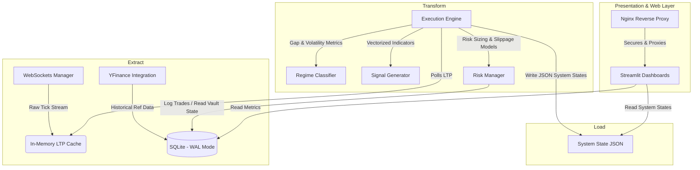
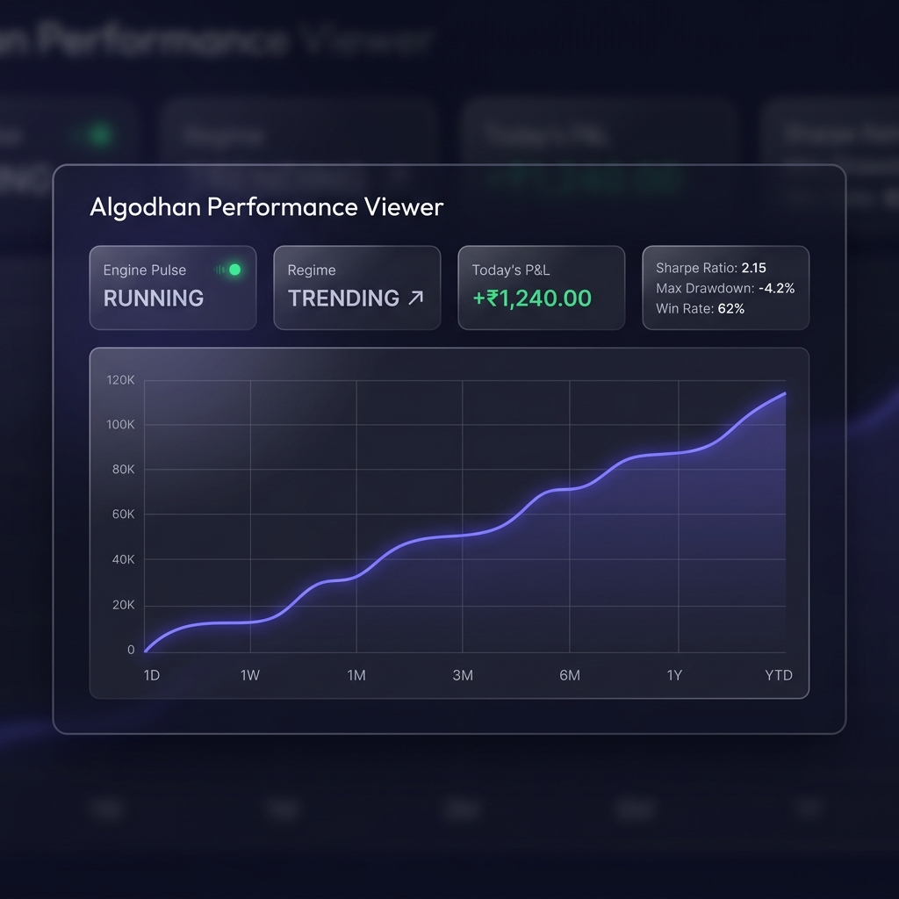

# Quant ETL Pipeline (Smart-Trade)

[](http://15.134.152.37/viewer)

An automated quantitative trading and analytics platform built using Python, Fyers API, SQLite (WAL), and Streamlit. The system performs real-time market data extraction via WebSockets, dynamic market regime classification, technical indicator transformation, signal generation, live trade execution with strict risk management, and portfolio analytics through a modular ETL pipeline architecture.

---

## 🏗️ System Architecture



---

## ✨ Features

- Real-time market data extraction via WebSockets (Fyers API)
- Automated ETL workflow for live tick data processing
- Vectorized technical indicator calculation (VWAP, EMA, MACD, RSI, ATR)
- Dynamic market regime classification (Trending vs. Choppy)
- Signal generation with multi-indicator confluence filters
- Live trade execution with programmatic risk sizing and trailing stop-losses
- Trade logging & PnL tracking in high-concurrency SQLite database
- Interactive Streamlit analytics and presentation dashboard
- Modular Python architecture with decoupled background services
- Automated exception recovery, Telegram alerts, and Email PnL reports

---

## 🛠️ Tech Stack

- **Language:** Python
- **APIs:** Fyers API, YFinance
- **Database:** SQLite (Write-Ahead Logging mode)
- **Data Processing:** Pandas, NumPy
- **Visualization:** Streamlit, Plotly
- **Infrastructure:** AWS EC2, Ubuntu systemd, Nginx

---

## 🔄 Workflow

1. **Fetch** real-time tick data via WebSockets from the broker API.
2. **Clean and cache** raw market data into an in-memory queue.
3. **Classify** the morning market regime using statistical Gap & Range analysis.
4. **Calculate** technical indicators (VWAP, EMA, MACD) via vectorized operations.
5. **Generate** trading signals based on strict multi-indicator confluence rules.
6. **Execute** trades applying dynamic 1.5% risk sizing and trailing stop-losses.
7. **Store** processed data and transaction logs into the SQLite database.
8. **Visualize** real-time analytics and portfolio risk metrics through the decoupled Streamlit dashboard.

---

## 📸 Dashboard Analytics

[](http://15.134.152.37/viewer)

*(Click the image above or visit [http://15.134.152.37/viewer](http://15.134.152.37/viewer) to view the live, interactive presentation-grade performance dashboard.)*

---

## 📂 Folder Structure

```text
algodhan-platform/
│
├── logs/                    # SQLite Trade Ledger and JSON state
├── config.py                # System Configuration & Risk Parameters
├── main.py                  # Main Execution Engine & State Controller
├── ws_manager.py            # Asynchronous WebSockets Tick Stream Manager
├── regime_detector.py       # Morning Statistical Market Classifier
├── strategy_pro.py          # Quantitative Indicator Math (EMA, RSI, ADX, ATR)
├── risk_manager.py          # Trade Execution & Position Sizing Logic
├── broker_fyers.py          # Abstracted Broker Client Interface
├── hyper_optimizer.py       # Multi-core Parallel Grid Search Optimizer
├── dashboard.py             # Streamlit Internal Analytical Admin UI
└── public_dashboard.py      # Presentation-Grade Public Performance Viewer
```

---

## 📈 Trading Strategy

The bot uses a sophisticated multi-timeframe, intraday momentum scalping strategy called **VWAP Pullback Scalper v7 ("Institutional Tide")**. It targets high-liquidity Nifty 50 stocks using a confluence of 7 distinct filters:

- **Trend Alignment:** Price must be positioned favorably relative to the 20 EMA and VWAP.
- **Regime Filter:** Underlying index trend and volatility must validate the direction.
- **Volume Spike:** Entry candles must exhibit volume > 1.5x of the 20-period volume SMA.
- **Momentum:** MACD histogram must be expanding in the trade direction.
- **Risk Management:** 
  - Dynamic stop-loss placed at swing extremes or 1.5x ATR.
  - Partial profit booking (TP1) at 1:1 Risk-Reward to lock in gains and trail SL to breakeven.
  - Multi-step trailing stop-loss for trend riding.
  - Hard time-exit at 15:15 IST.

---

## ⚙️ Engineering Highlights

- **Modular ETL Architecture:** Designed a pipeline to automate market data ingestion, transformation, and signal generation while strictly separating data processing from trade execution logic.
- **High-Concurrency Persistence:** Configured SQLite with Write-Ahead Logging (WAL) mode and `synchronous=NORMAL` to allow the trading engine to write high-frequency transaction logs without locking out frontend dashboard reads.
- **Vectorized Operations:** Replaced standard Python loops with Pandas and NumPy vectorization to process hours of 5-minute time-series logs in milliseconds, eliminating computational lag during live execution.
- **Parallel Grid Search:** Utilized Python’s `multiprocessing.Pool` to bypass the Global Interpreter Lock (GIL), distributing parameter optimization calculations across all available AWS CPU cores.
- **Decoupled Visualization:** Built the Streamlit dashboards as isolated reader processes, ensuring UI computations (like Sharpe Ratio and Drawdown) never block the critical execution loop.
- **Resiliency:** Implemented automated connection-recovery mechanisms for WebSockets, daily drawdown kill switches, and systemd daemon management for unattended AWS deployment.

---

## ☁️ AWS Cloud & Deployment Infrastructure

To ensure 24/7 reliability, process isolation, and security, the platform is deployed using modern cloud-native systems engineering practices on **AWS**:

* **Virtual Private Server:** Hosted on an **AWS EC2 (Ubuntu Linux)** instance optimized for low-latency network calls to the broker WebSockets.
* **Nginx Reverse Proxy Routing:** Configured Nginx to act as a secure gateway. Public traffic hitting port `80` is reverse-proxied to internal localhost ports (`127.0.0.1:8502`), blocking direct public internet access to raw backend ports.
* **Process Daemonization (Systemd):** Deployed execution engines and dashboards as systemd service daemons, enabling:
  - Automatic system recovery on process crashes.
  - Graceful shutdowns and startup sequencing.
  - Automatic boot-time auto-start.
* **Network & Security Groups:** Restricted inbound EC2 security groups to only allow port `80/443` (HTTP/HTTPS) and `22` (SSH via restricted IP range), isolating internal application ports.

---

## 🚀 Future Improvements

- **Ingestion Message Broker:** Integrate Apache Kafka or RabbitMQ to decouple tick data ingestion from processing.
- **Time-Series Database:** Migrate tick logs to TimescaleDB or ClickHouse for optimized OLAP data querying at scale.
- **API Interface:** Implement a FastAPI web service to serve data endpoints and handle authentication tokens.
- **Frontend Client:** Rebuild the Streamlit dashboard in React.js / Next.js to prevent script-reload bottlenecks.
- **Machine Learning Integration:** Train an XGBoost model on the `logs/` data for predictive regime classification.

---

## 📝 Repository Notice (Showcase Version)

**This is a sanitized, public-facing structural showcase.** To protect proprietary trading edges, live API keys, and production databases, the core predictive logic and live execution components have been abstracted. 

The complete, fully operational trading system resides in a private repository.

### Exploring the Codebase

You are welcome to explore the systems engineering, ETL pipelines, and architecture:
- **Data Ingestion:** Review `core/ws_manager.py` for asynchronous tick stream handling.
- **Risk Engine:** Review `core/risk_manager.py` for position sizing and capital preservation logic.
- **UI & Analytics:** Review `dashboard/public_dashboard.py` for the Streamlit presentation layer.
- **Deployment:** Review the `docs/` folder for sample Nginx reverse proxy and systemd service configurations.

### Running the Dashboard Sandbox

While the live trading engine is abstracted, you can still run the analytics dashboard locally using dummy data:

```bash
# 1. Clone the repository
git clone https://github.com/Mat-rixMJ/quant-etl-pipeline.git
cd quant-etl-pipeline

# 2. Install dependencies
pip install -r requirements.txt

# 3. Generate sandbox mock trades
python dashboard/populate_data.py

# 4. Run the dashboard viewer
streamlit run dashboard/public_dashboard.py
```

---

## 🎥 Demo Video

*[Insert link to a short 2-minute Loom or YouTube video demonstrating the live system and dashboard here]*
